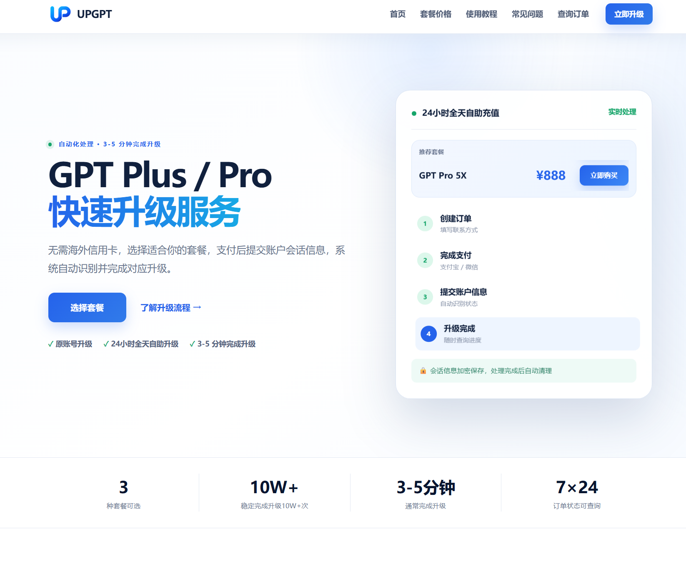
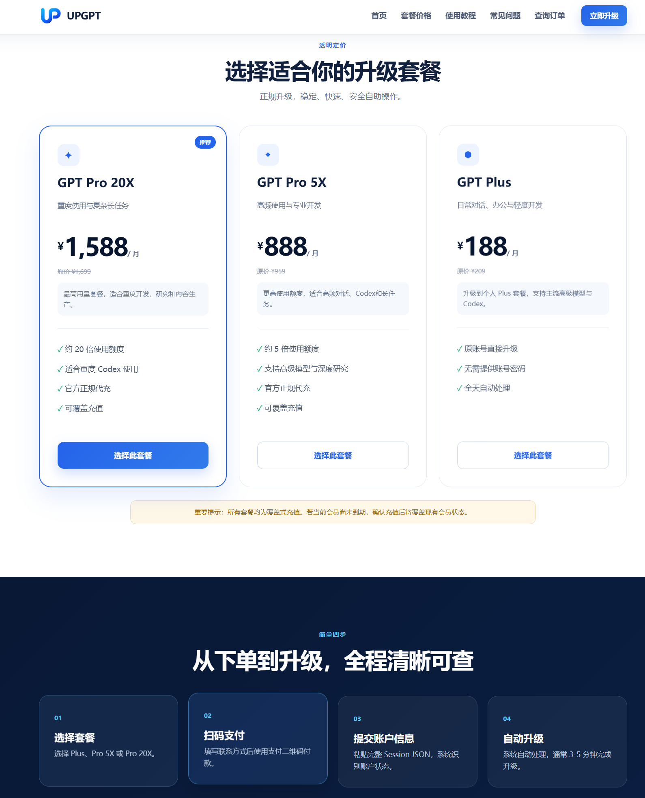
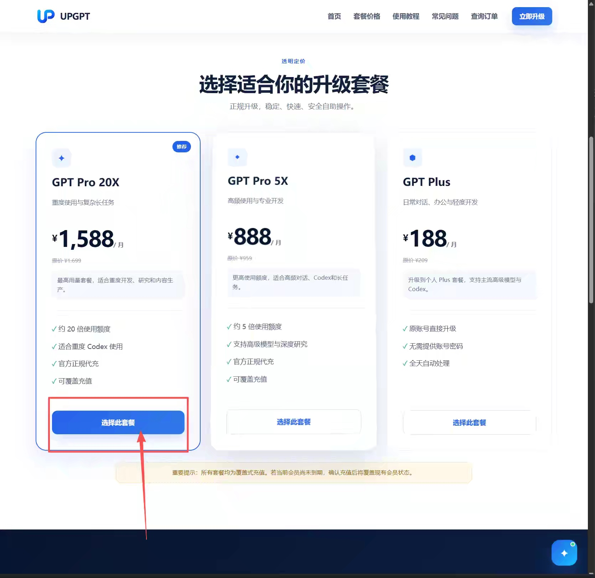
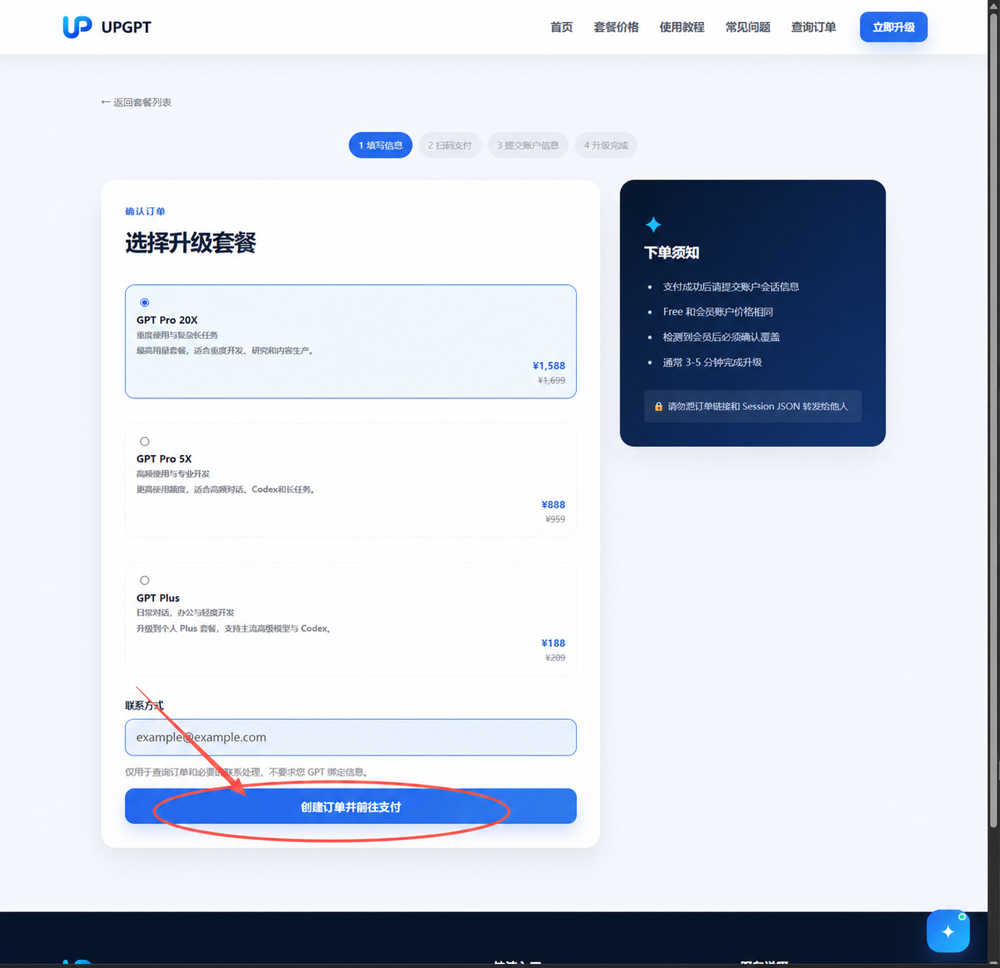
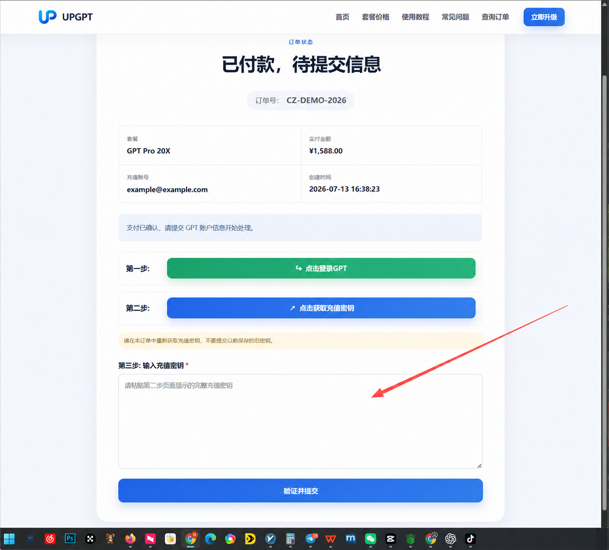
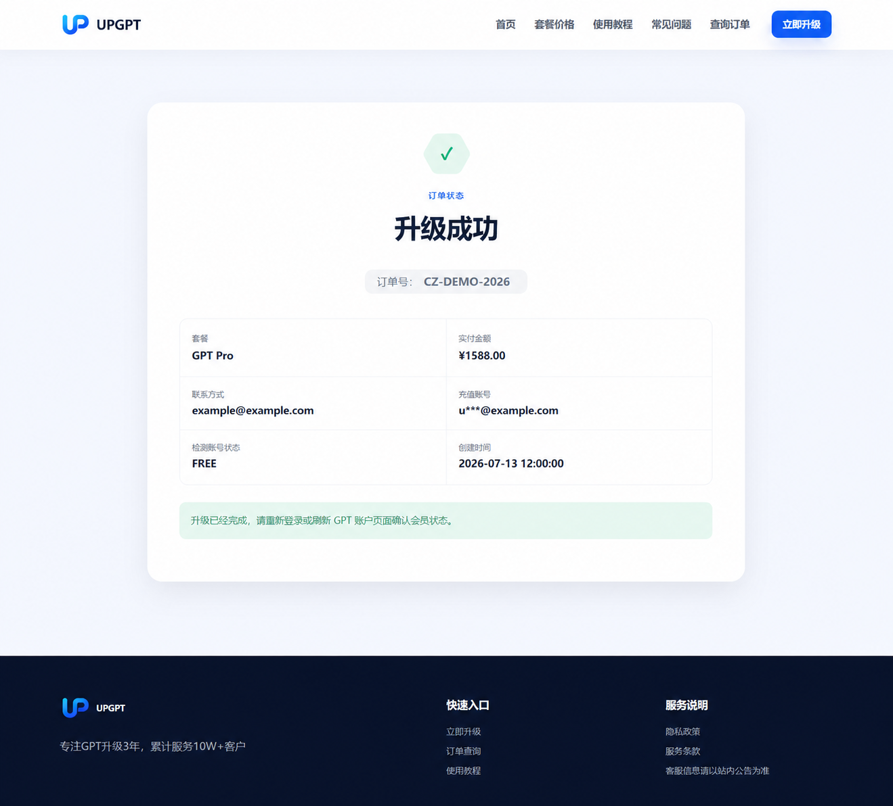

  

# 2026 ChatGPT Plus / Pro 5X / Pro 20X 自助升级教程

没有海外 Visa / Mastercard，或者不熟悉 ChatGPT 官网订阅流程，也可以使用人民币完成 GPT 付费套餐升级。本教程介绍如何通过 **UPGPT** 为自己的原 ChatGPT 账号升级 **GPT Plus、GPT Pro 5X 或 GPT Pro 20X**。

> 官网入口：[https://upgpt.pro](https://upgpt.pro)  
> 更新时间：2026 年 7 月 14 日。套餐、价格与页面流程可能调整，请以下单页面实时信息为准。

## UPGPT 是什么？

UPGPT 是面向国内 ChatGPT 用户的第三方自助升级服务，适合没有海外信用卡、支付被拒，或不熟悉官网订阅操作的用户。

- 原 ChatGPT 账号升级，不是多人共享账号
- 支持 GPT Plus、GPT Pro 5X、GPT Pro 20X
- 支持支付宝 / 微信支付
- 7×24 小时自助下单，通常 3–5 分钟完成处理
- 可在订单页面查询处理状态

**重要说明：** UPGPT 是独立第三方服务平台，并非 OpenAI 官方网站，与 OpenAI 没有隶属关系。

## 套餐怎么选？

| 套餐 | 参考价格 | 适合人群 | 主要特点 |
| --- | ---: | --- | --- |
| GPT Plus | ¥188 / 月 | 日常对话、办公、学习、轻度开发 | 原账号升级，支持主流高级模型与 Codex |
| GPT Pro 5X | ¥888 / 月 | 高频对话、专业开发、长任务 | 约 5 倍使用额度，适合深度研究和较高频 Codex 使用 |
| GPT Pro 20X | ¥1,588 / 月 | 重度开发、研究、内容生产 | 约 20 倍使用额度，适合高强度 Codex 和复杂长任务 |

> 所有套餐均为**覆盖式充值**。如果当前会员尚未到期，确认充值后会覆盖现有会员状态，请在付款前核对剩余有效期。

## 自助升级流程

### 第一步：从官网选择套餐

打开 [UPGPT 官网](https://upgpt.pro)，在套餐区域选择 Plus、Pro 5X 或 Pro 20X，然后点击“选择此套餐”。

### 第二步：创建订单并完成支付

填写用于订单查询和必要售后联系的联系方式，创建订单后使用页面显示的支付宝或微信二维码完成付款。

### 第三步：按订单页提示提交账户授权信息

付款成功后，订单会进入“待提交信息”状态。按照订单专属页面的提示登录 GPT、获取本次充值所需的授权信息，并在原订单页面提交验证。

> **安全提醒：** 账户授权信息的敏感程度等同登录凭据。只从 [https://upgpt.pro](https://upgpt.pro) 进入订单流程；不要通过微信、QQ、邮件、群聊或陌生链接转发，不要公开截图。处理完成后建议退出其他设备会话并检查账号安全状态。

### 第四步：等待处理并确认套餐

系统通常会在 3–5 分钟内完成处理。订单显示升级成功后，重新登录或刷新 ChatGPT，确认账号套餐和权益已经更新。

## 常见问题

### 需要提供 ChatGPT 账号密码吗？

页面不要求直接填写账号密码，但订单处理需要一次性账户授权信息。它同样属于敏感登录凭据，必须只在从 UPGPT 官网进入的订单专属页面提交。

### 已经是 Plus 或 Pro，还能充值吗？

可以，但当前套餐会被覆盖。请先确认现有会员剩余时间是否可以接受被覆盖，再继续付款和提交。

### 一般多久完成？

网站标注通常为 3–5 分钟。实际时间会受支付确认、账号状态和系统处理情况影响，请以订单状态为准。

### 升级后在哪里使用？

升级绑定在原 ChatGPT 账号上。确认权益到账后，可继续使用该账号登录 ChatGPT 网页端或官方客户端。

### 付款后没有马上升级怎么办？

先通过站内“查询订单”核对状态，不要重复创建订单。需要协助时，以官网公布的客服入口为准，并只提供订单号等必要信息；不要在聊天工具中发送账户授权信息。

## 下单前检查清单

- 确认当前访问的是 [https://upgpt.pro](https://upgpt.pro)
- 核对套餐名称、价格以及是否会覆盖现有会员
- 使用自己的常用联系方式，以便查询订单
- 只在订单专属页面提交账户授权信息
- 完成后刷新 ChatGPT 并核对套餐状态

## 相关入口

- [UPGPT 官网](https://upgpt.pro)
- [选择套餐](https://upgpt.pro/#pricing)
- [使用教程](https://upgpt.pro/blog)
- [查询订单](https://upgpt.pro/order/search)

---

如果这篇教程对你有帮助，欢迎点一个 **Star** 收藏。后续套餐或流程变化会继续在本仓库更新。

### 商标与免责声明

ChatGPT、GPT、OpenAI 等名称和商标归其各自权利人所有。本仓库仅用于介绍第三方升级服务流程，不代表 OpenAI 官方背书。使用任何第三方服务前，请自行评估账号、隐私、支付和售后风险。
